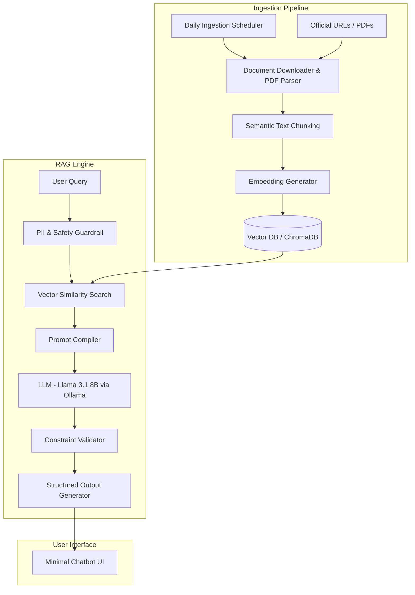

# Architecture: Mutual Fund FAQ Assistant (Facts-Only RAG)

This document details the system architecture for the Mutual Fund FAQ Assistant. The system employs a Retrieval-Augmented Generation (RAG) framework optimized for accuracy, compliance, and strict adherence to official data sources.

---

## 1. System Overview

The system consists of three core layers: the **Ingestion Pipeline**, the **RAG Engine**, and the **User Interface**. 

---

## 2. Component Breakdown

### A. Ingestion Pipeline
- **Daily Ingestion Scheduler**:
  - A cron-like scheduling utility (e.g., Celery Beat, APScheduler, or a standard daily cron job) that triggers the Ingestion Pipeline once every 24 hours.
  - Ensures the local document store and vector embeddings are refreshed daily with the latest official AMC publication metrics (e.g., updated NAV, exit loads, expense ratios, and fund managers).
- **Document Downloader & Parser**: 
  - Downloads PDFs and HTML pages from the designated SBI Mutual Fund corpus (15-25 URLs).
  - Uses robust, table-aware text extraction (such as `pdfplumber` or OCR layouts) to parse Scheme Information Documents (SIDs), Key Information Memorandums (KIMs), factsheets, and help guides.
- **Text Chunking Engine**:
  - Implements a recursive character text splitter with a chunk size of 800 characters and 150 characters overlap.
  - Embeds mandatory metadata tags into each chunk (source URL, document title, and document extraction/publication date).
- **Embedding Generator**:
  - Generates dense vector embeddings using a local HuggingFace model (e.g., `all-MiniLM-L6-v2`) or OpenAI embeddings.
- **Vector Database**:
  - Uses `ChromaDB` (or `FAISS`) to store embeddings and metadata for fast similarity searches.

### B. RAG Engine
- **PII & Safety Guardrail**:
  - Pre-processes user inputs to detect and redact sensitive personally identifiable information (PII) like PAN, Aadhaar numbers, account numbers, OTPs, email addresses, or phone numbers before any Vector DB search or LLM interaction.
- **Retriever**:
  - Uses cosine similarity to fetch the top-5 most relevant chunks from the vector database.
  - Filters out chunks below a minimum similarity score threshold (e.g., 0.5) to prevent hallucinations.
- **Refusal & Redirection Handler**:
  - Evaluates user queries for non-factual, speculative, or advisory intents.
  - Bypasses LLM generation and directly serves polite, compliance-friendly refusals linked to official SEBI/AMFI educational resources.
  - Intercepts performance-related or return calculation queries and redirects the user directly to the official scheme factsheet.
- **Prompt Compiler**:
  - Compiles the final prompt combining retrieved chunks, user queries, and system constraints.
- **Large Language Model (LLM)**:
  - Uses **Llama 3.1 8B** served locally via **Ollama** to synthesize factual, source-backed responses under strict generation rules. Completely free — no API key or billing required.
- **Constraint Validator**:
  - Programmatically verifies that the output contains at most 3 sentences, exactly one citation link, and is appended with a "Last updated from sources: <date>" footer.

### C. User Interface
- A clean, modern chat interface built with HTML, CSS, and vanilla JavaScript.
- Displays a prominent welcome message, three suggested example questions, and a visible disclaimer:
  > Facts-only. No investment advice.

---

## 3. Data Flow

1. **Daily Update Process**: The **Daily Ingestion Scheduler** triggers at midnight. The downloader pulls fresh AMC documents, parses text and tables, and refreshes the Vector Database.
2. **User Input & Scrubbing**: The user submits a query. The safety guardrail redacts any PII.
3. **Retrieval**: The engine performs similarity search. If the query seeks advice/comparisons, or if no chunks meet the similarity threshold, the refusal handler returns a standard compliant response.
4. **Factual Response Synthesis**: If valid, the prompt compiler forwards context chunks and query to **Llama 3.1 8B (via Ollama)** running locally.
5. **Validation**: The validator verifies sentence length (max 3), single source link citation, and date footer format before displaying the response in the UI.
